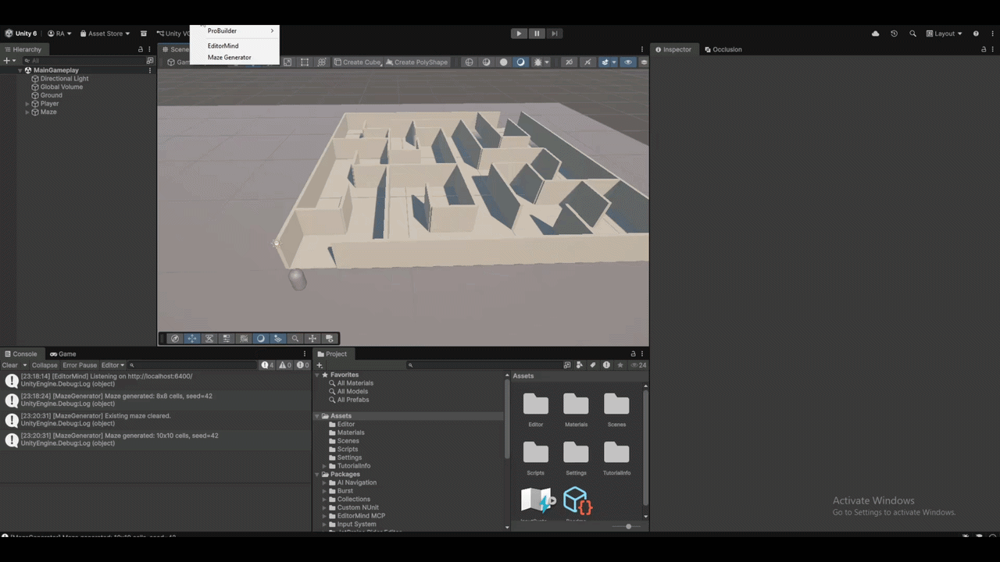

# editormind-mcp

> AI agent control for Unity Editor via the Model Context Protocol.

**editormind-mcp** bridges AI coding agents with the Unity Editor. It exposes Unity Editor functionality as MCP tools, allowing an AI agent to inspect scenes, create GameObjects, read and write C# scripts, trigger compilation, and more — all through natural language.

No Node.js required. No terminal commands. Just install, download the server, and click Configure.

Built to be AI-agnostic: Claude Code today, other MCP clients in the future.

---

## Demo



---

## How it works

```
Claude Code  ──(MCP stdio)──►  EditorMind binary (downloaded on first use)  ──(HTTP)──►  Unity Editor (C# Bridge)
```

- **Unity package** — an `[InitializeOnLoad]` C# class starts an HTTP listener on `localhost:6400` automatically when the Editor opens. Requests are processed on the main thread via a `ConcurrentQueue`, so responses arrive even when Unity is not in focus.
- **Standalone binary** — a pre-compiled MCP server downloaded from GitHub releases on first use. No Node.js or npm required. Downloaded once, cached permanently.
- **EditorMind window** — one-click download, one-click configure via `Tools → EditorMind`. Auto-detects platform and downloads the correct binary.
- **No internet required after setup** — everything runs locally.

---

## Tools

| Tool | Description |
|---|---|
| `get_scene_hierarchy` | Returns all GameObjects in the active scene with components and children |
| `get_selected_object` | Returns the selected GameObject's name, components, transform, and hierarchy path |
| `create_gameobject` | Creates a new GameObject with a given name, optional primitive type and parent |
| `compile_scripts` | Triggers script compilation via `CompilationPipeline.RequestScriptCompilation()` |
| `get_compile_errors` | Reports whether the project has compile errors |
| `read_script` | Reads a C# script file from the Unity project |
| `write_script` | Writes content to a C# script file and triggers reimport |

---

## Requirements

- Unity **2021.3**, **2022.3**, or **Unity 6** (URP or Built-in)
- Claude Code CLI — install from [claude.ai/code](https://claude.ai/code)
- Internet connection for first-time binary download

No Node.js required.

---

## Installation

### Step 1 — Install the Unity package

Open your Unity project, go to:

**Window → Package Manager → + → Add package from git URL**

Paste this URL:

```
https://github.com/raheeb-ahmad/editormind-mcp.git?path=UnityPackage
```

Unity will compile automatically. Check the Console for:

```
[EditorMind] Listening on http://localhost:6400/
```

### Step 2 — Download the server binary

In Unity, open:

**Tools → EditorMind**

The window will show **Server binary: Not found** on first install. Click **Download Server** — the correct binary for your platform will download automatically and show a progress bar.

This only happens once. The binary is cached permanently on your machine.

### Step 3 — Configure Claude Code

Once the binary is downloaded and shows **Found**, click **Configure Claude Code**.

The window automatically registers editormind-mcp with your Claude Code installation. No terminal commands needed.

### Step 4 — Start using it

Click **Copy Project Path** in the EditorMind window, open a terminal at your Unity project root and run:

```bash
claude
```

That's it. Start prompting.

---

## Usage examples

```
What GameObjects are in my current Unity scene?

Create a GameObject called EnemySpawner

Read the script at Assets/Scripts/PlayerMovement.cs and add a sprint mechanic

Trigger a recompile in Unity

Are there any compile errors in my project?
```

---

## EditorMind window

Open via **Tools → EditorMind**. The window shows:

- **Server binary** — download status and path to the cached executable
- **Bridge** — live ping to the HTTP listener (updates every 2 seconds)
- **Claude MCP** — whether Claude Code has been configured
- **Update available** — notifies when a newer version is released with one-click update
- **Available tools** — list of all 7 tools
- **Copy Project Path** — copies your Unity project path for opening Claude Code

---

## Updates

When a new version is available the EditorMind window will show an **Update available** banner with the version number. Click **Update** to open the releases page and **Release notes** to see what changed.

The window checks for updates once per hour automatically.

---

## Windows: fix port access (if needed)

If Unity throws an `HttpListener` access denied error, run once in PowerShell as Administrator:

```powershell
netsh http add urlacl url=http://localhost:6400/ user=Everyone
```

---

## Project structure

```
editormind-mcp/
├── UnityPackage/
│   ├── Editor/
│   │   ├── EditorMindBridge.cs     # HTTP listener, boots with Unity
│   │   ├── EditorMindTools.cs      # Tool handlers
│   │   └── EditorMindWindow.cs     # Tools → EditorMind setup window
│   ├── Server~/                    # MCP server source (hidden from Unity importer)
│   │   ├── index.js
│   │   └── package.json
│   └── package.json                # Unity Package Manager manifest
├── .github/
│   └── workflows/
│       └── build.yml               # CI/CD — builds binaries and attaches to releases
├── .gitignore
└── README.md
```

Binaries are not stored in the repo. They are built automatically via GitHub Actions on each release and downloaded by the EditorMind window on first use.

---

## CI/CD

Binaries are automatically built for Windows, macOS, and Linux via GitHub Actions on every release tag and attached to the GitHub release. To trigger a new release:

```bash
git tag v1.x.x
git push origin v1.x.x
```

---

## Roadmap

**Coming soon:**
- Screenshot capture from Scene and Game view
- Run Unity Test Runner and return results
- Add and modify components on GameObjects
- Support for Cursor, Gemini, Copilot and other MCP clients

**Long term vision:**
- Runtime AI — control game systems and NPCs while the game is playing
- Playtesting agent — AI plays your game autonomously and reports bugs
- Project-wide refactoring — AI understands your full codebase architecture
- Voice prompts — speak to your Editor instead of typing

---

## License

MIT — see [LICENSE](LICENSE)

---

## Author

[Raheeb Ahmad](https://github.com/raheeb-ahmad) — Software Engineer & Game Developer
